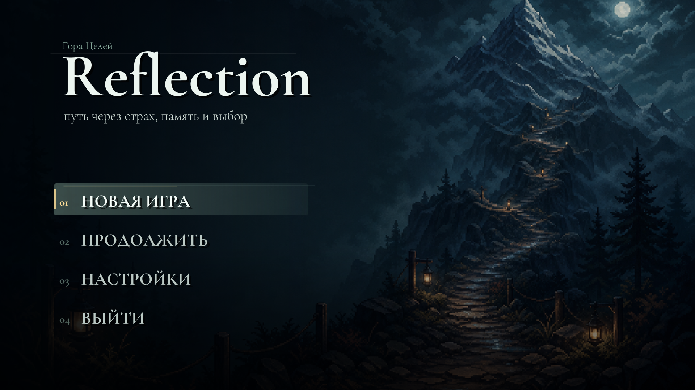
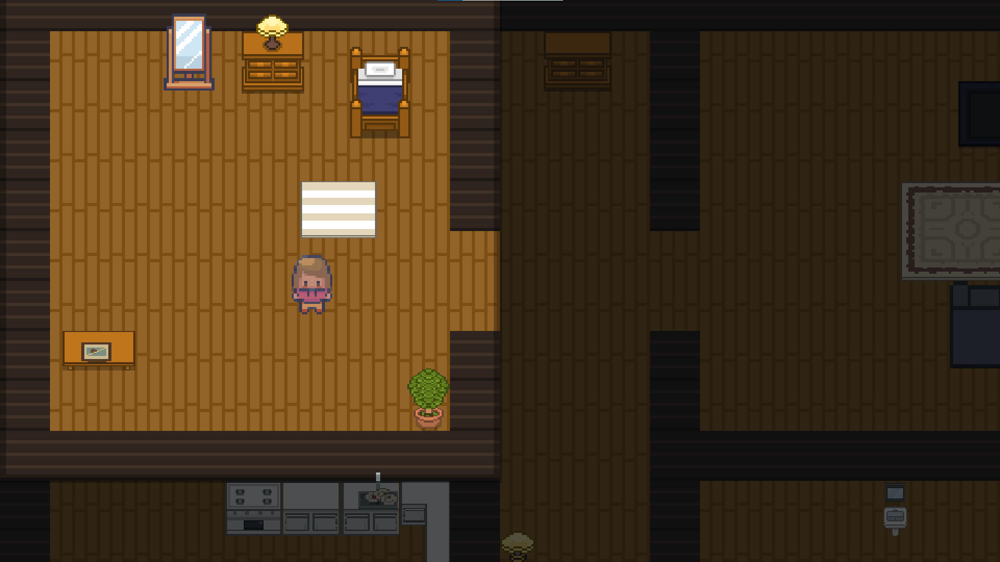
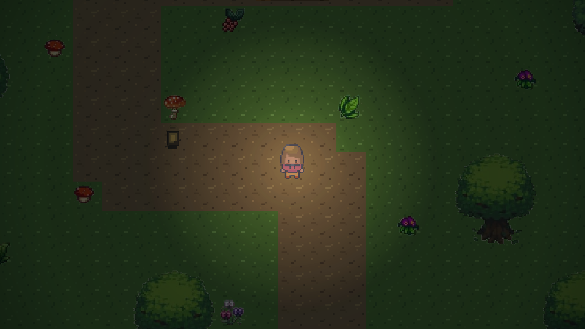
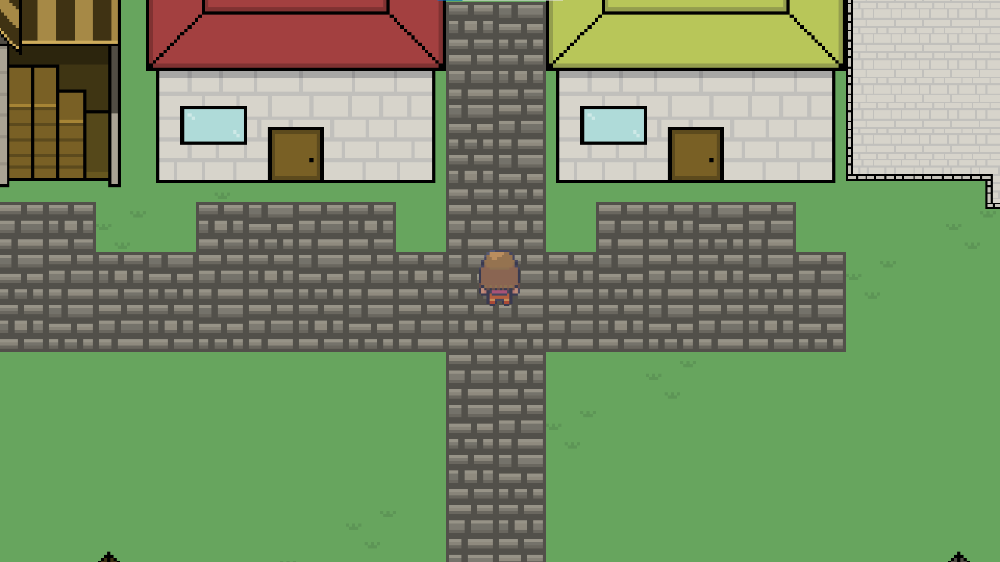
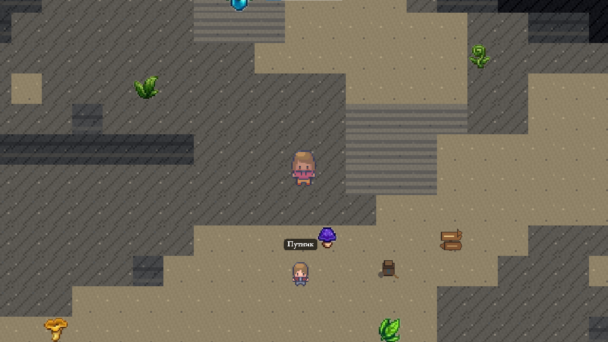
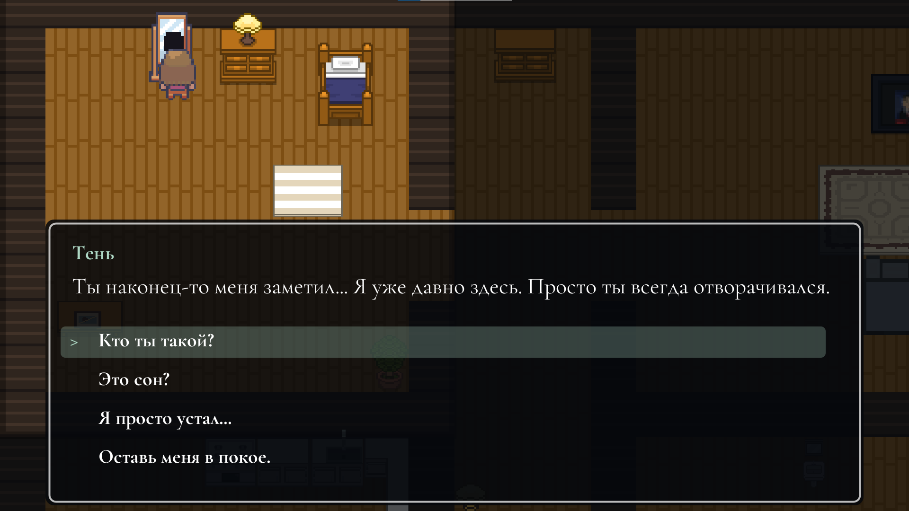
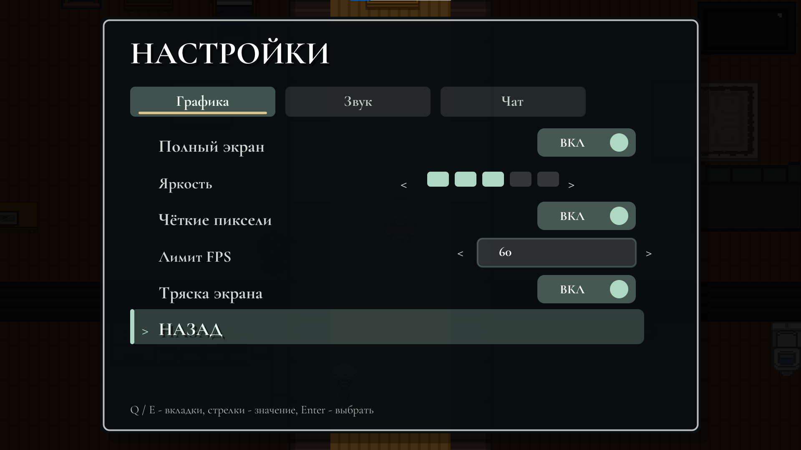
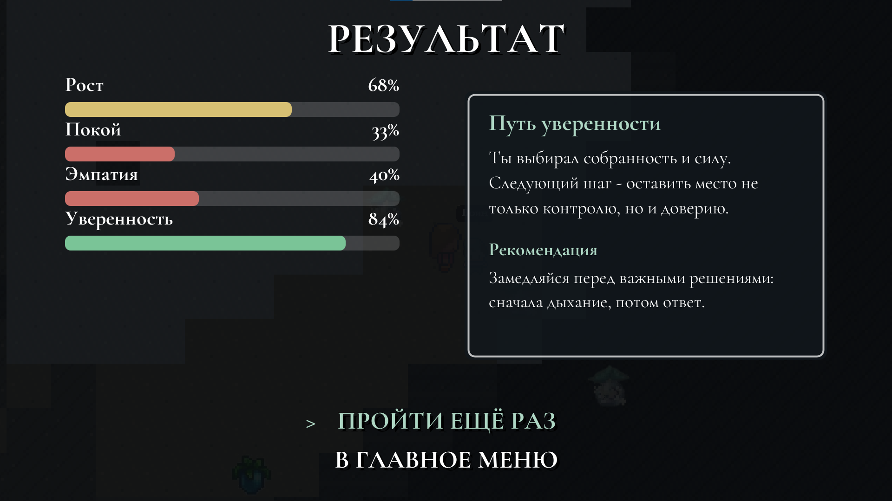

# 🪞 Reflection

A story-driven 2D game built in **Java (Swing / Java2D)**, with no external game engine. The player travels through a character's inner world, interacts with objects and NPCs, and makes choices that shape a final psychological profile.

Built as an academic project, it demonstrates a full game built from scratch: the game window and rendering, a dialogue system, save/load, multiple locations, and a final results report.



## 📖 About

The player starts in an apartment, performs simple actions, interacts with the environment, and gradually moves through symbolic locations: a forest, a village, a library, and a mountain. The core idea is to reflect a person's inner state through choices, dialogue, and in-game events.

Every meaningful choice affects a set of internal metrics:

- Growth
- Calm
- Empathy
- Confidence
- Responsibility
- Avoidance
- Self-worth

At the end of the playthrough, the game builds a final player profile and saves the result as a PDF report.

## ✨ Features

- Story-driven playthrough with multiple stages
- Dialogue with NPCs
- Branching answers in key scenes
- Player metrics that shift based on choices
- Several game locations
- Interaction with environment objects
- Save/load system
- Player name input
- Final psychological profile
- PDF report generation
- Graphics, sound, and language settings
- Ready-made Windows portable build

## 🖼️ Screenshots

| | |
|---|---|
|  Apartment — first steps and everyday actions |  Forest of Doubts — facing uncertainty and choice |
|  Village of Connections — interacting with other characters |  Mountain of Goals — the final stretch of the path |
|  Dialogue with an NPC |  Settings screen |


*Final player profile — metric bars plus a text recommendation.*

## 🛠 Tech Stack

- **Java** — main programming language
- **Swing** — application window and interface handling
- **Java2D** — rendering the character, map, objects, and UI
- **AWT** — graphics, keyboard, and mouse event handling
- **HTML / CSS / JavaScript** — landing page and docs site
- **GitHub Actions** — build and release automation
- **GitHub** — source control and hosting

## 📁 Project Structure

```
Reflection/
├── .github/workflows/    # Build automation
├── dist/                 # Packaged build & distributables
├── docs/                 # Project documentation page (GitHub Pages)
├── landing/              # Project landing page
├── res/                  # Game resources
│   ├── font/             # Fonts
│   ├── maps/             # Maps
│   ├── npc/               # NPC sprites
│   ├── objects/           # Environment objects
│   ├── player/            # Player sprites
│   ├── sound/             # Sound
│   ├── tiles/              # Map tiles
│   └── trees/              # Decorative elements
└── src/                  # Game source code
    ├── data/             # Save data
    ├── entity/           # Player and NPCs
    ├── main/             # Game loop, window, UI, sound, story
    ├── object/           # Static objects
    ├── test/             # Test classes
    └── tile/             # Tile and map handling
```

## 🎮 Controls

| Action | Keys |
|---|---|
| Move | W / A / S / D or arrow keys |
| Run | Shift |
| Interact | E or Enter |
| Confirm choice | Enter |
| Skip/reveal dialogue text | Space |
| Pause | P or Esc |
| Menu navigation | W / S or arrow keys |
| Settings | Q / Tab to switch tabs |

## 🚀 Running the Prebuilt Version

The repository includes a ready-made Windows build:

```
dist/Reflection-windows-portable.zip
```

To run the game:
1. Download the archive
2. Extract it to a folder of your choice
3. Run `Reflection.exe`

## 🧑‍💻 Building from Source

**Windows:**
```bash
dir /s /b src\*.java > sources.txt
javac -encoding UTF-8 -d out @sources.txt
java -cp "out;res" main.Main
```

**Linux / macOS:**
```bash
find src -name "*.java" > sources.txt
javac -encoding UTF-8 -d out @sources.txt
java -cp "out:res" main.Main
```

## 🕹️ Gameplay

The playthrough is built around exploring locations and making decisions. The player interacts with objects, completes small tasks, talks to characters, and unlocks memories. Internal metrics shift depending on the answers chosen.

Main stages of the playthrough:

1. **Apartment** — everyday actions and the first inner events
2. **Forest of Doubts** — facing uncertainty and choice
3. **Village of Connections** — interacting with other characters
4. **Library** — making sense of what's been experienced
5. **Mountain of Goals** — the final part of the journey and the resulting profile

## 📊 Final Result

After finishing the game, the player receives a final profile, built from the choices made and the metrics accumulated throughout the playthrough. It can be used to showcase the project's logic, analyze player behavior, or as part of an academic defense.

The game also saves a PDF report recording the events of the playthrough and the player's key decisions.

## 🎯 Project Goal

To develop an interactive 2D game where the story, choices, and in-game events are used to build a conditional psychological profile of the player.

## ✅ Project Tasks

During development, the following was implemented:

- Game concept and story structure
- Location system and transitions between them
- Character movement and control
- NPCs and a dialogue system
- Choices that affect internal metrics
- User interface
- Game resources, sound, and visual elements
- Save/load system
- Final PDF report generation
- Windows portable build

## 📌 Project Status

The project is in a working state. The repository contains the source code, resources, a documentation page, a landing page, and a ready-made Windows portable build.

## 👤 Author

Developer: **riokoqee**

## 📄 License

Not specified in the repository. Check with the author before use or distribution.

---

# 🪞 Reflection (Русский)

**Reflection** — это сюжетная 2D-игра на Java, в которой игрок проходит через внутренний мир персонажа, взаимодействует с объектами, NPC и делает выборы, влияющие на итоговый психологический профиль.

Проект выполнен как учебная разработка и демонстрирует создание игры без готового игрового движка: от игрового окна и отрисовки до системы диалогов, сохранений, локаций и итогового отчёта.


## 📖 О проекте

Игрок начинает прохождение в квартире, выполняет простые действия, взаимодействует с окружением и постепенно переходит в символические локации: лес, деревню, библиотеку и гору. Основная идея игры — показать внутреннее состояние человека через выборы, диалоги и игровые события.

Каждый важный выбор влияет на набор внутренних показателей:

- рост;
- спокойствие;
- эмпатия;
- уверенность;
- ответственность;
- избегание;
- самоценность.

В конце прохождения игра формирует итоговый профиль игрока и сохраняет результат в виде PDF-отчёта.

## ✨ Основные возможности

- сюжетное прохождение с несколькими этапами;
- диалоги с NPC;
- выбор ответов в ключевых сценах;
- изменение внутренних метрик игрока;
- несколько игровых локаций;
- взаимодействие с объектами окружения;
- система сохранений;
- ввод имени игрока;
- итоговый психологический профиль;
- генерация PDF-отчёта;
- настройки графики, звука и языка;
- готовая portable-сборка для Windows.

## 🖼️ Скриншоты

| | |
|---|---|
|  Квартира — первые шаги и бытовые действия |  Лес сомнений — столкновение с неуверенностью и выбором |
|  Деревня связей — взаимодействие с другими персонажами |  Гора целей — финальная часть пути |
|  Диалог с NPC |  Экран настроек |


*Итоговый игровой профиль — шкалы метрик и текстовая рекомендация.*

## 🛠 Технологии

Проект разработан с использованием следующих технологий:

- **Java** — основной язык программирования;
- **Swing** — создание окна приложения и обработка интерфейса;
- **Java2D** — отрисовка персонажа, карты, объектов и UI;
- **AWT** — работа с графикой, событиями клавиатуры и мыши;
- **HTML / CSS / JavaScript** — лендинг и документационная часть проекта;
- **GitHub Actions** — подготовка сборок и релизов;
- **GitHub** — хранение исходного кода и контроль версий.

## 📁 Структура проекта

```
Reflection/
├── .github/workflows/    # автоматизация сборки проекта
├── dist/                 # готовая сборка и файлы для распространения
├── docs/                 # документационная страница проекта
├── landing/              # лендинг проекта
├── res/                  # игровые ресурсы
│   ├── font/             # шрифты
│   ├── maps/             # карты
│   ├── npc/              # спрайты NPC
│   ├── objects/          # объекты окружения
│   ├── player/           # спрайты игрока
│   ├── sound/            # звуки
│   ├── tiles/            # тайлы карты
│   └── trees/            # декоративные элементы
└── src/                  # исходный код игры
    ├── data/             # сохранения и данные
    ├── entity/           # игрок и NPC
    ├── main/             # игровой цикл, окно, UI, звук, сюжет
    ├── object/           # статические объекты
    ├── test/             # тестовые классы
    └── tile/             # работа с тайлами и картой
```

## 🎮 Управление

| Действие | Клавиши |
|---|---|
| Движение | W / A / S / D или стрелки |
| Бег | Shift |
| Взаимодействие | E или Enter |
| Подтвердить выбор | Enter |
| Пропустить/раскрыть текст диалога | Space |
| Пауза | P или Esc |
| Навигация по меню | W / S или стрелки |
| Настройки | Q / Tab для переключения вкладок |

## 🚀 Запуск готовой версии

В репозитории есть готовая Windows-сборка:

```
dist/Reflection-windows-portable.zip
```

Чтобы запустить игру:
1. скачайте архив;
2. распакуйте его в удобную папку;
3. запустите `Reflection.exe`.

## 🧑‍💻 Сборка из исходников

**Windows:**
```bash
dir /s /b src\*.java > sources.txt
javac -encoding UTF-8 -d out @sources.txt
java -cp "out;res" main.Main
```

**Linux / macOS:**
```bash
find src -name "*.java" > sources.txt
javac -encoding UTF-8 -d out @sources.txt
java -cp "out:res" main.Main
```

## 🕹️ Игровой процесс

Прохождение построено вокруг исследования локаций и принятия решений. Игрок взаимодействует с предметами, выполняет небольшие задачи, разговаривает с персонажами и открывает воспоминания. В зависимости от выбранных ответов изменяются внутренние показатели персонажа.

Основные этапы прохождения:

1. квартира — бытовые действия и первые внутренние события;
2. лес сомнений — столкновение с неуверенностью и выбором;
3. деревня связей — взаимодействие с другими персонажами;
4. библиотека — осмысление накопленного опыта;
5. гора целей — финальная часть пути и итоговый профиль.

## 📊 Итоговый результат

После завершения игры пользователь получает итоговый профиль. Он формируется на основе сделанных выборов и накопленных метрик. Результат может быть использован для демонстрации логики проекта, анализа пользовательского поведения и защиты учебной работы.

Игра также сохраняет PDF-отчёт, в котором фиксируются события прохождения и ключевые решения игрока.

## 🎯 Цель проекта

Цель проекта — разработать интерактивную 2D-игру, в которой сюжет, выборы и игровые события используются для формирования условного психологического профиля пользователя.

## ✅ Задачи проекта

В ходе разработки были реализованы следующие задачи:

- разработана концепция игры и сюжетная структура;
- создана система локаций и переходов между ними;
- реализовано управление персонажем;
- добавлены NPC и диалоговая система;
- реализованы выборы, влияющие на внутренние метрики;
- создан пользовательский интерфейс;
- добавлены игровые ресурсы, звуки и визуальные элементы;
- реализована система сохранений;
- подготовлена итоговая генерация PDF-отчёта;
- собрана portable-версия для Windows.

## 📌 Статус проекта

Проект находится в рабочем состоянии. В репозитории присутствуют исходный код, ресурсы, документационная страница, лендинг и готовая portable-сборка для Windows.

## 👤 Автор

Разработчик: **riokoqee**

## 📄 Лицензия

Лицензия в репозитории не указана. Перед использованием или распространением проекта необходимо уточнить права у автора.
